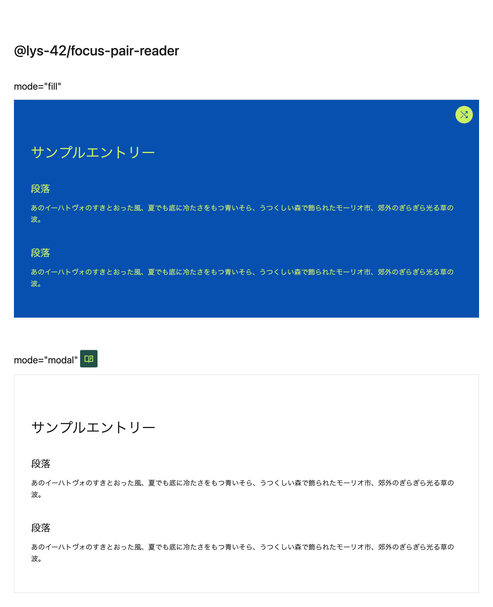

# lys-colors

Easy Computational Theming Library and Custom Element.

## Related

- [Components AI — A new way to explore generative design systems](https://components.ai/notes/computational-theming)
- [Randoma11y - Accessible color combinations](https://randoma11y.com/)

## Demo

https://ergofriend.github.io/lys-colors/

