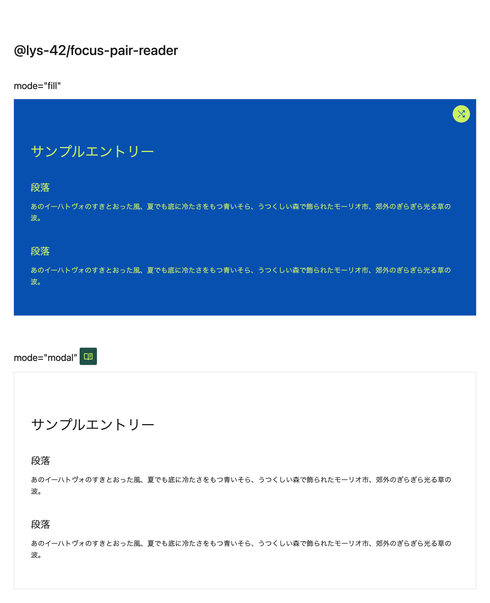

# @ergofriend/focus-pair-reader

```html
<script defer type="module" src="https://unpkg.com/@ergofriend/focus-pair-reader"></script>
```

## usage

All attributes are optional.

| Attribute | Default | Type |
|-----------|---------|-------------|
| `text-color` | undefined | Can be set to a random color. Possible values are hex color string or unspecified. |
| `background-color` | unspecified | Can be set to a random color. Possible values are hex color string or unspecified. |
| `threshold` | `"70"` | You can limit the contrast between text and background colors. The closer to 100, the better the visibility. |
| `mode` | `"fill"` | Specifies the mode of the focus pair reader. Possible values are `"fill"` and `"modal"`. |
| `target` | `"#target-root"` | For modal mode only. Query selector for the element you want to display in the modal content. |
| `no-control` | undefined | For fill mode only. Hide the color change button. Possible value is `true`. |
| `external-link` | undefined | An array of external style paths like `'["./style.css"]'`. |

### reader mode

```html
<focus-pair-reader text-color="#000000" no-control="true">
  <p>This is reader element.</p>
</focus-pair-reader>
```

### modal mode

```html
<focus-pair-reader target="#target-root" mode="modal" external-link='["./style.css"]' />
<article id="target-root">
  <p>This is modal element.</p>
</article>
```

## development

### build

```sh
npm -w @ergofriend/focus-pair-reader run build
```

### dev

```sh
npm -w @ergofriend/focus-pair-reader run dev
```

http://localhost:5173/


